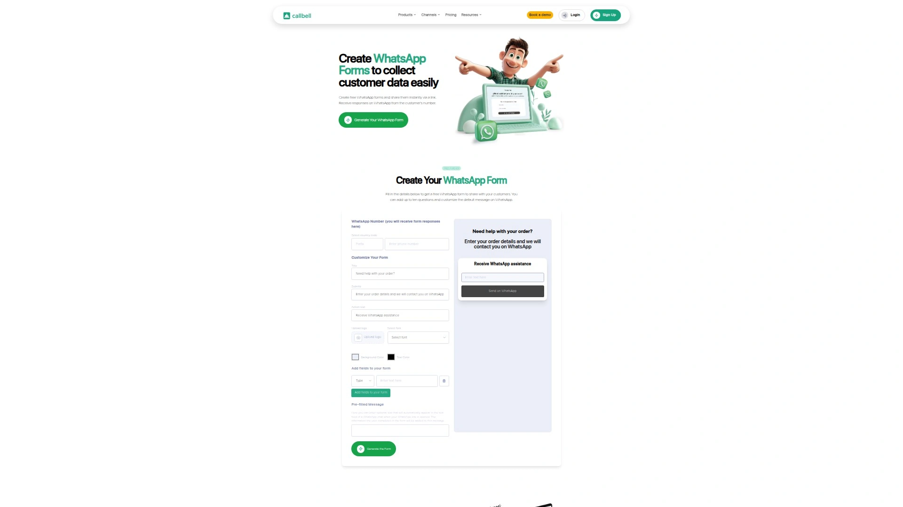
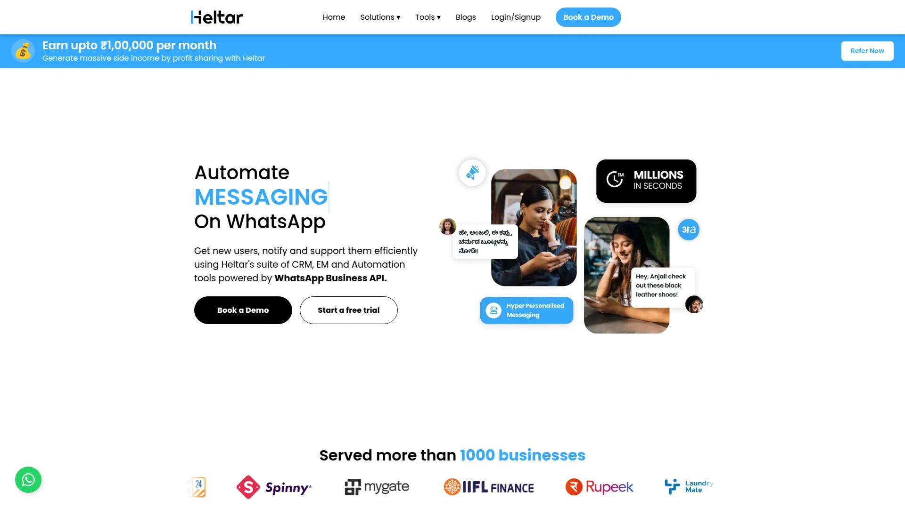

# Top 10 WhatsApp Form Builders Ranked in 2025 (Latest Compilation)

Running a business on WhatsApp means dealing with the same questions over and over, and let's be honest—it drains your energy faster than a phone battery on 1%. WhatsApp form builders solve this by letting customers fill out details before the chat even starts, so you get straight to helping them instead of playing twenty questions. Whether you're collecting orders, booking appointments, or gathering feedback, these tools turn scattered conversations into organized workflows.

## **[WhatsForm](https://whatsform.com/)**

The drag-and-drop champion for businesses that want zero hassle.

WhatsForm makes creating forms feel like chatting with a friend—no technical mumbo-jumbo, just a simple builder that anyone can use. The platform lets you build forms from scratch or convert Google Forms in one click, which is perfect when you're migrating from basic tools. You get form responses delivered straight to your WhatsApp from the customer's actual number, maintaining that personal connection businesses crave.

The platform supports translation into major languages, making it ideal for businesses serving diverse customer bases. Ready-to-use templates for travel bookings, restaurant orders, customer feedback, and event registrations mean you're never starting from a blank page. The free forever plan removes financial barriers, while paid plans unlock advanced features for growing teams.

What sets it apart: responses land directly in your WhatsApp chat with genuine customer phone numbers, eliminating the disconnect between data collection and conversation. This creates a 98% open rate because customers are already on the app they check constantly.

## **[2Chat](https://2chat.co/tools/whatsapp-forms)**

Free form creation with zero coding headaches.

2Chat positions itself as the go-to platform for businesses wanting custom forms without hiring a developer. The platform handles leads, orders, bookings, and general inquiries through WhatsApp, consolidating everything into one communication channel. Build your forms entirely for free and capture customer data in the app where engagement rates crush email by miles.

Best suited for small businesses testing WhatsApp as a sales channel before committing to premium tools.

## **[Callbell](https://qr.callbell.eu/en/landing_page_tools/new)**

Create mobile-optimized forms in under two minutes without accounts.

Callbell's WhatsApp Form Generator stands out by letting you build forms without even creating an account—just fill in your questions and get a shareable link. The tool supports up to ten questions per form with customizable default messages, making it flexible enough for most business scenarios. Forms work beautifully for collecting feedback, securing demo reservations, qualifying contacts, managing event registrations, and receiving orders.

The three-step process keeps things simple: users fill out the form, data transmits to your WhatsApp number, and a conversation begins automatically. Share your form link directly on websites, social media posts and stories, or embed it in emails to reach customers wherever they hang out. The tool remains free forever, removing cost concerns entirely.

## **[Heltar](https://www.heltar.com/)**

WhatsApp automation powerhouse with native form capabilities.

Heltar transforms WhatsApp into a complete business platform with forms, bulk messaging, workflow automation, and real-time analytics all under one roof. The drag-and-drop WhatsApp Flows Builder lets you create forms with text inputs, multiple-choice questions, dropdown menus, and date pickers. Forms are mobile-friendly by default since most WhatsApp users access the app on phones.

Build your form by navigating to Integrations, then WhatsApp Flows Builder, then Create Flow. Heltar generates a unique link after publishing, which you can share in WhatsApp chats, groups, status updates, or embed on websites and social media. All submissions appear in your Heltar dashboard with instant WhatsApp notifications for new entries. The platform eliminates app-switching hassles whether you're managing event registrations or gathering customer feedback.

**Technical advantage:** Heltar connects seamlessly with CRM systems and supports real-time message responses, making it suitable for teams handling high conversation volumes.

## **[Interakt](https://www.interakt.shop/resource-center/whatsapp-form/)**

Interactive forms that convert 150% better than basic chatbots.

Interakt specializes in WhatsApp Forms that create interactive experiences rather than static data collection. The platform works exclusively through WhatsApp Business API, requiring a Business Solution Provider account. Forms can be attached to message templates and sent in bulk campaigns, driving event registrations, collecting service feedback, or generating offer opt-ins.

Building forms happens directly in the Interakt dashboard: access the automation dropdown, select WhatsApp Forms, then choose Create New or browse existing templates. The form editor includes default screens you can customize by adding or removing elements. Field types include single or multiple choice, dropdowns, and opt-ins, with real-time previews showing exactly how forms will appear to customers. Mark fields as mandatory or optional depending on data priorities.

Forms work on both Android and iOS phones, though they can only be viewed and filled in WhatsApp's mobile app. Track performance by exporting reports filtered by time range, delivered straight to your email.

## **[AiSensy](https://aisensy.com/features/whatsapp-forms)**

Lead collection meets instant chatbot follow-ups.

AiSensy approaches WhatsApp Forms as part of a complete lead generation funnel, capturing high-intent leads and triggering automated follow-ups immediately. The platform collects user inputs without redirects, keeping customers inside WhatsApp throughout the entire journey. Forms integrate with chatbots to qualify leads instantly based on responses, segmenting contacts automatically.

Use cases range from collecting feedback and gathering user insights to lead qualification and product recommendations. The platform supports Click-to-WhatsApp ads integration, connecting paid campaigns directly to form experiences. AiSensy provides tools for creating chatbots, running ads, capturing form data, segmenting users, sending broadcasts, and tracking conversions—all without coding.

**Why businesses choose it:** Over 90% open rates combined with automated qualification create scalable lead systems that don't require manual message sorting.

## **[Jotform](https://www.jotform.com/integrations/whatsapp)**

Established form builder with WhatsApp notification capabilities.

Jotform brings enterprise-grade form building to WhatsApp through integration features that send submission notifications directly to your WhatsApp account. Get real-time alerts as soon as someone submits your form, enabling faster responses and more personal communication. The integration keeps conversations going and adds a personal touch to business interactions.

Setting up takes minutes: access Form Builder, click Settings, navigate to Integrations, search for WhatsApp, then verify your WhatsApp number. Jotform's AI Agents can be published directly to WhatsApp for conversational form experiences. The platform supports form creation from templates, custom field building, and integration with thousands of business tools through Zapier.

Suited for businesses already using Jotform who want to extend their form ecosystem to WhatsApp without switching platforms.

## **[Typeform](https://www.typeform.com/)**

Conversational forms that boost completion rates through one-question-at-a-time design.

Typeform revolutionizes form experiences by presenting questions one by one rather than overwhelming users with lengthy pages. This conversational interface improves response rates significantly, making it perfect for customer feedback collection and marketing campaigns. The platform focuses on premium user experience with custom branding, images, videos, and conditional logic.

Lead qualification features include AI-powered question generation based on your business description and ideal customer profile. Set lead scoring rules on multiple choice, dropdown, picture choice, yes/no, legal, opinion scale, and rating questions. High-priority leads can be automatically directed to Calendly scheduling blocks for immediate demo bookings. Lower-priority qualified leads can be redirected to gated content or self-serve demos, keeping them engaged.

Real-time analytics track performance while integrations with HubSpot, Zapier, and Mailchimp connect forms to broader marketing systems.

## **[Tally](https://tally.so/)**

Unlimited forms with zero usage restrictions.

Tally removes traditional barriers to professional form creation through a document-style editor that feels natural. Type and use "/" commands to insert payment blocks, file uploads, conditional logic, and other elements without wrestling with complex drag-and-drop interfaces. The platform prioritizes accessibility and unlimited usage over premium restrictions.

Collect contact information, files, signatures, payments, and much more through forms ranging from surveys to quizzes to lead generation. The generous free tier makes Tally ideal for startups and small businesses watching budgets carefully. While it doesn't have native WhatsApp integration, forms can be shared via links in WhatsApp messages or combined with automation tools to bridge the gap.

## **[Heyflow](https://heyflow.com/)**

Multi-step forms optimized for lead generation and conversions.

Heyflow specializes in interactive multi-step forms that segment questions into digestible chunks, reducing user overwhelm and increasing completion rates. Unlike static forms, Heyflow's approach offers personalized experiences with interactive elements like sliders for better data accuracy. Templates vetted by conversion rate experts cover lead generation, recruiting, quote calculation, research, and feedback collection.

Customization reaches enterprise levels through Simple or Expert Design Mode, with options to add HTML blocks or CSS for advanced needs. The drag-and-drop builder requires minimal technical knowledge while maintaining flexibility for teams wanting granular control. Page speed scores rank among the highest according to Google PageSpeed, ensuring forms won't slow down websites.

**Perfect for:** Companies prioritizing conversion optimization and requiring detailed form analytics to refine lead generation strategies.

## How quickly can someone start collecting WhatsApp form responses?

Most platforms let you create and share forms within 2-5 minutes, with tools like Callbell and WhatsForm offering template-based setups that require just filling in questions. More advanced platforms like Heltar and Interakt might need 10-15 minutes for initial configuration but provide richer automation features.

## Do customers need special apps to fill out WhatsApp forms?

No additional apps are required—forms work directly within WhatsApp's mobile app on both Android and iOS devices. Customers click the shared link, fill out the form inside WhatsApp, and submit without leaving the platform.

## Can forms handle complex workflows like appointment scheduling?

Yes, several platforms support advanced workflows including payment collection, file uploads, conditional logic, and calendar integrations. Tools like Typeform connect with Calendly for scheduling while Tally handles payment blocks directly in forms.

## Collect Customer Data Without the Question Marathon

WhatsApp form builders turn scattered information gathering into smooth, professional experiences that respect your time and your customers' patience. For businesses wanting the fastest path from form creation to WhatsApp responses with genuine phone numbers, [WhatsForm](https://whatsform.com/) delivers that personal connection without technical barriers or monthly fees eating into budgets. The drag-and-drop simplicity combined with Google Forms conversion and multilingual support makes it the practical choice for teams who want results today, not after a week of setup.
